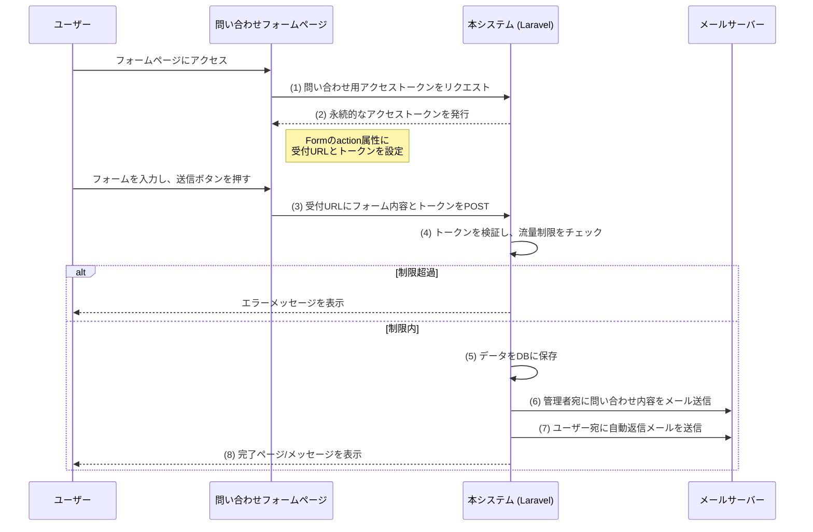

# 問い合わせフォームバックエンドシステム 要件定義書

## 1. 概要
本システムは、外部のウェブサイトに設置された問い合わせフォームからのリクエストを安全かつ効率的に受け取り、管理するためのバックエンド機能を提供します。
主な機能として、ユーザー管理、権限管理、問い合わせフォームの作成・設定、問い合わせ内容の受信・保存、メール通知、自動返信、問い合わせ履歴の管理、流量制限、プラン管理などを備えています。
これにより、システム管理者や一般ユーザーが柔軟に問い合わせフォームを運用できる環境を提供します。

## 2. システム構成図（想定フロー）



## 3. 機能要件
### 3.1. ユーザー・権限管理
- **登録トークンによる招待制:** ユーザー登録には、システム管理者が発行した**登録トークン**が必須となる。
- **ロールベースの権限管理 (RBAC):**
    - システムには**役割（ロール）**が存在し（例: `システム管理者`, `一般ユーザー`）、ユーザーには一つまたは複数のロールが割り当てられる。
    - 各ロールには、実行可能な操作（**権限（パーミッション）**、例: `forms.create`, `users.delete`）が紐付けられる。
    - これにより、ユーザーが持つロールに応じて、アクセスできる機能が厳密に制御される。
    - システム管理者は、ユーザーのロールを管理し、各ロールに紐づく権限を編集できる。
- **登録トークン管理:**
    - システム管理者は、ユーザー招待用の**登録トークン**を発行・一覧表示・削除できる。
    - 発行されたトークンは何度でも使用可能。
    - どのユーザーがどのトークンを使用して登録したかが記録される。
    - トークンには有効期限や、特定のメールアドレスのみに利用を限定する設定も可能。
### 3.2. 問い合わせフォーム設定機能
- 認証されたユーザーは、自身の問い合わせフォームを管理できる。
- フォームごとに、以下の情報を管理できる。
    - フォーム名（識別用）
    - 問い合わせ通知メールの送信先アドレス
    - 自動返信メールの有効/無効設定
    - 利用するメールテンプレート（管理者通知用、自動返信用）
- フォーム作成時、システムのデフォルトメールテンプレートが自動で設定される。
- ドメインを登録することで送信元を限定できる。ない場合は全てのドメインからの送信を許可する。
### 3.3. アクセストークン発行機能
- フォームからの問い合わせを受け付けるための、アクセストークンを発行する。
- 有効期限がnullの場合は永続的なトークンとなる。
- このトークンは、問い合わせ受付APIを利用するための認証キーとして機能する。
### 3.4. 問い合わせ内容受信・処理機能
- 発行されたアクセストークンを含む `POST` されたフォームデータを受け取る。
- トークンを送信元のドメインを検証し、流量制限を確認する。
- 検証と流量制限チェックが成功した場合、非同期で以下の処理を実行する。
    1. 問い合わせ内容をデータベースに保存する。
    2. 通知メールを送信する。
    3. 自動返信メールを送信する。
    4. 添付ファイルの保存: フォームに添付されたファイルを保存し、問い合わせ内容に紐付ける。
### 3.5. メールテンプレート管理機能 (CRUD)
- 管理者権限を持つユーザーは、メールテンプレートを管理できる。
- システムにデフォルトのメールテンプレートが用意されており、フォーム作成時に自動で設定される。
### 3.6. 問い合わせ履歴管理機能
- ユーザーは自身のフォームの問い合わせ履歴を閲覧できる。
- 管理者は全ての問い合わせ履歴を閲覧できる。
### 3.7. 問い合わせ流量制限機能
- フォームごとに、問い合わせの受信回数をAPIで設定・管理できる。
- 流量制限は、1ヶ月あたりの問い合わせ受信回数で設定される。
- 流量制限を超過した場合、以降の問い合わせ受付は拒否され、エラーメッセージが返される。
- 流量制限のリセットは毎月1日に自動で行われる。
- 流量制限の設定は、ユーザーのプランに基づいて自動的に適用される。
### 3.8. プラン管理機能
- プランの種類や内容は、システム管理者が管理画面から追加・編集・削除できる。
- プランの種類:
  - システムには以下の2種類のプランが存在する。
    - 無料プラン
    - 有料プラン
  - プランの制約は将来的に拡張可能とする。:
- プランの制約:
  - 無料プラン: フォーム作成数の上限は1個まで。問い合わせ流量制限は1ヶ月100件。（将来的に拡張予定）
  - 有料プラン: フォーム作成数の上限は1個まで。問い合わせ流量制限は1ヶ月1000件。（将来的に拡張予定）
- プラン変更:
  - 無料プランから有料プランへの変更: 制約は即時解除される。
  - 有料プランから無料プランへの変更: 制約を超過しているデータ（例: 作成済みフォーム）は削除されないが、新規作成は制約内に収まる必要がある。
- 課金管理:
  - 有料プランの支払いはStripeやPayPalなどの決済サービスを利用して管理する。

## 4. API設計（案）
- **認証・認可:**
    - API認証には **Laravel Sanctum** を利用する。
    - `/register`, `/login`, `/submit/{token}` といった一部の公開エンドポイントを除き、`/api/v1/` で始まる全ての管理系APIは認証が必須。
    - 認証が必要なAPIへアクセスするには、まず `/login` エンドポイントで認証を行い、発行されたAPIトークンを以降のリクエストのヘッダー（`Authorization: Bearer {token}`）に含めて送信する必要がある。
    - 各エンドポイントではRBAC（ロールベースアクセス制御）に基づき、ユーザーの役割に応じた操作制限が行われる。
- **APIレスポンス形式:**
    - APIのレスポンスは、以下のJSON形式に統一する。
    - **成功時 (`2xx`系ステータスコード):**
        ```json
        {
            "data": {
                // レスポンスデータ本体
            }
        }
        ```
    - **エラー時 (`4xx`, `5xx`系ステータスコード):**
        ```json
        {
            "message": "エラーの概要メッセージ",
            "errors": {
                "field_name": ["エラー詳細1", "エラー詳細2"]
            }
        }
        ```

| エンドポイント | HTTPメソッド | 説明 | 対象ロール・権限 |
| :--- | :--- | :--- | :--- |
| `/register` | `POST` | ユーザー登録（要登録トークン） | 全員 |
| `/login` | `POST` | ログイン | 全員 |
| `/logout` | `POST` | ログアウト | 認証ユーザー |
| `/api/v1/registration-tokens` | `GET`, `POST` | 登録トークンの一覧取得・発行 | `users.manage` |
| `/api/v1/registration-tokens/{id}` | `DELETE` | 登録トークンの削除 | `users.manage` |
| `/api/v1/users` | `GET` | ユーザー一覧取得 | `users.view` |
| `/api/v1/users/{id}` | `PUT` | ユーザー情報（作成数上限など）を更新 | `users.manage` |
| `/api/v1/users/{id}/roles` | `GET`, `PUT` | ユーザーのロールを取得・更新 | `roles.manage` |
| `/api/v1/roles` | `GET`, `POST` | ロール一覧取得・作成 | `roles.manage` |
| `/api/v1/roles/{id}` | `GET`, `PUT`, `DELETE` | ロール詳細・更新・削除 | `roles.manage` |
| `/api/v1/permissions` | `GET` | 権限一覧取得 | `roles.manage` |
| `/api/v1/forms` | `GET`, `POST` | フォーム作成・一覧取得 | `forms.create` |
| `/api/v1/forms/{id}` | `GET`, `PUT`, `DELETE` | フォーム詳細・更新・削除 | `forms.manage` (所有者) |
| `/submit/{token}` | `POST` | （公開）フォームからのデータ受付 | 全員 |
| `/api/v1/inquiries` | `GET` | 問い合わせ履歴一覧 | `inquiries.view` |
| `/api/v1/templates` | `GET`, `POST` | メールテンプレート作成・一覧 | `templates.manage` |
| `/api/v1/templates/{id}` | `GET`, `PUT`, `DELETE` | テンプレート詳細・更新・削除 | `templates.manage` |
| `/api/v1/plans` | `GET` | プラン一覧取得 | 全員 |
| `/api/v1/plans` | `POST` | プランの作成 | `plans.manage` |
| `/api/v1/plans/{id}` | `GET` | プラン詳細取得 | `plans.manage` |
| `/api/v1/plans/{id}` | `PUT` | プランの更新 | `plans.manage` |
| `/api/v1/plans/{id}` | `DELETE` | プランの削除 | `plans.manage` |
| `/api/v1/users/{id}/plan` | `PUT` | ユーザーのプラン変更 | `users.manage` |

## 5. データベース設計（案）
**1. users**
| カラム名 | 型 | 説明 |
| :--- | :--- | :--- |
| `id` | `bigint`, `PK` | ユーザーID |
| `name` | `varchar` | ユーザー名 |
| `email` | `varchar`, `unique` | メールアドレス |
| `password` | `varchar` | パスワード |
| `plan_id` | `foreignId` | ユーザーに紐付くプランID（デフォルト: 無料プラン） |
| `registration_token_id` | `foreignId`, `nullable` | 登録時に使用された登録トークンのID |
| `created_at`, `updated_at` | `timestamp` | 作成日時, 更新日時 |
**2. forms (フォーム設定)**
| カラム名 | 型 | 説明 |
| :--- | :--- | :--- |
| `id` | `bigint`, `PK` | フォームID |
| `user_id` | `foreignId` | このフォームを所有するユーザーID |
| `name` | `varchar` | フォーム名 |
| `recipient_email` | `varchar` | 通知先メールアドレス |
| `notification_template_id` | `foreignId` | 管理者通知用テンプレートID |
| `auto_reply_enabled` | `boolean` | 自動返信の有効/無効 |
| `auto_reply_template_id` | `foreignId` | 自動返信用テンプレートID |
| `created_at`, `updated_at` | `timestamp` | 作成日時, 更新日時 |
**3. inquiries (問い合わせ履歴)**
| カラム名 | 型 | 説明 |
| :--- | :--- | :--- |
| `id` | `bigint`, `PK` | 問い合わせID |
| `form_id` | `foreignId` | 関連するフォームのID |
| `data` | `json` | 問い合わせ内容 |
| `attachment_path` | `varchar`, `nullable` | 添付ファイルの保存パス |
| `created_at`, `updated_at` | `timestamp` | 作成日時, 更新日時 |
**4. email_templates (メールテンプレート)**
| カラム名 | 型 | 説明 |
| :--- | :--- | :--- |
| `id` | `bigint`, `PK` | テンプレートID |
| `name` | `varchar` | テンプレート名 |
| `type` | `enum('notification', 'auto_reply')` | テンプレート種別 |
| `subject` | `varchar` | 件名 |
| `body` | `text` | 本文 |
| `is_default` | `boolean` | デフォルトテンプレートか |
| `created_at`, `updated_at` | `timestamp` | 作成日時, 更新日時 |
**5. access_tokens (フォーム受付トークン)**
| カラム名 | 型 | 説明 |
| :--- | :--- | :--- |
| `id` | `bigint`, `PK` | トークンID |
| `token` | `varchar`, `unique` | 一意のトークン |
| `form_id` | `foreignId` | 関連するフォームのID |
| `expires_at` | `timestamp`, `nullable` | トークンの有効期限 |
| `created_at` | `timestamp` | 作成日時 |
**6. registration_tokens (登録トークン)**
| カラム名 | 型 | 説明 |
| :--- | :--- | :--- |
| `id` | `bigint`, `PK` | トークンID |
| `token` | `varchar`, `unique` | 一意の登録トークン |
| `email` | `varchar`, `nullable` | 招待を許可するメールアドレス（nullは制限なし） |
| `expires_at` | `timestamp`, `nullable` | トークンの有効期限 |
| `created_by` | `foreignId` | 発行した管理者ユーザーのID |
| `created_at`, `updated_at` | `timestamp` | 作成日時, 更新日時 |
**7. roles (役割)**
| カラム名 | 型 | 説明 |
| :--- | :--- | :--- |
| `id` | `bigint`, `PK` | ロールID |
| `name` | `varchar`, `unique` | ロール名 |
| `description` | `varchar`, `nullable` | ロールの説明 |
| `created_at`, `updated_at` | `timestamp` | 作成日時, 更新日時 |
**8. permissions (権限)**
| カラム名 | 型 | 説明 |
| :--- | :--- | :--- |
| `id` | `bigint`, `PK` | 権限ID |
| `name` | `varchar`, `unique` | 権限名 |
| `description` | `varchar`, `nullable` | 権限の説明 |
| `created_at`, `updated_at` | `timestamp` | 作成日時, 更新日時 |
**9. role_user (ユーザーのロール)**
| カラム名 | 型 | 説明 |
| :--- | :--- | :--- |
| `role_id` | `foreignId` | ロールID |
| `user_id` | `foreignId` | ユーザーID |
**10. permission_role (ロールの権限)**
| カラム名 | 型 | 説明 |
| :--- | :--- | :--- |
| `permission_id` | `foreignId` | 権限ID |
| `role_id` | `foreignId` | ロールID |
**11. plans (プラン情報)**
| カラム名 | 型 | 説明 |
| :--- | :--- | :--- |
| `id` | `bigint`, `PK` | プランID |
| `name` | `varchar` | プラン名 |
| `description` | `text` | プランの説明 |
| `form_limit` | `integer`, `nullable` | フォーム作成数の上限（nullは無制限） |
| `monthly_limit` | `integer`, `nullable` | 1ヶ月の問い合わせ上限（nullは無制限） |
| `price` | `decimal` | プランの月額料金 |
| `created_at`, `updated_at` | `timestamp` | 作成日時, 更新日時 |

## 6. 非機能要件
- **セキュリティ:**
    - 全ての管理APIは認証・認可によって保護する。
    - SQLインジェクション、クロスサイトスクリプティング（XSS）等の基本的な脆弱性対策を行う。
    - フォームからの入力値はすべてバリデーションを行う。
    - メールヘッダインジェクション対策を行う。
    - 流量制限を超えたリクエストは適切に遮断する。
- **パフォーマンス:**
    - メール送信処理はキューを利用した非同期処理とし、ユーザーを待たせないようにする。
    - データベースには適切なインデックスを設定し、検索パフォーマンスを維持する。
- **可用性:**
  - メール送信に失敗した場合、数回リトライする仕組みを導入する。
- **課金処理:**
  - StripeやPayPalなどの決済サービスを利用して、有料プランの支払いを管理する。
  - サブスクリプションの状態（有効/無効）を定期的にチェックし、無効な場合は無料プランに自動的にダウングレードする。
